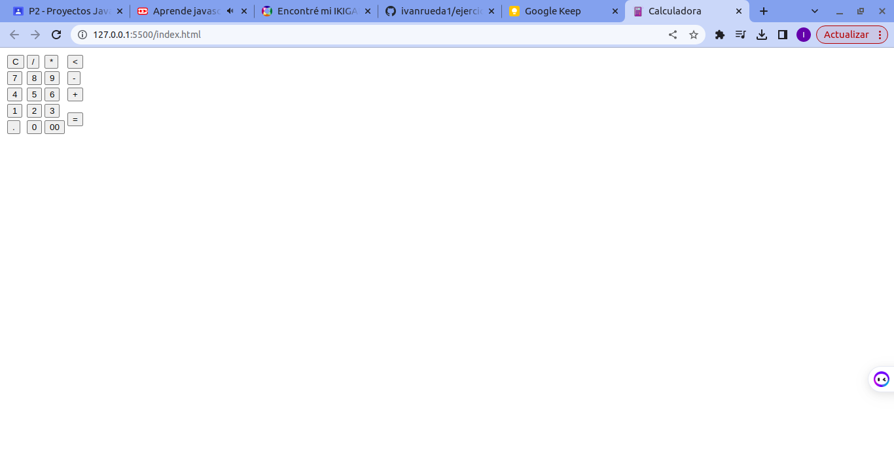
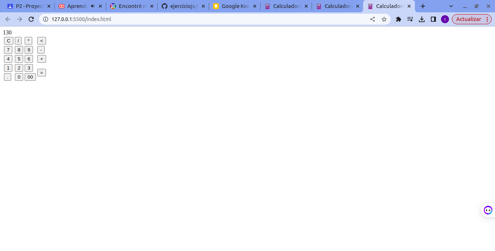
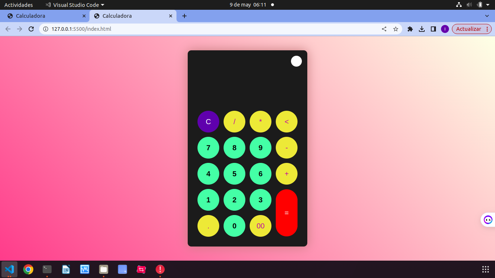
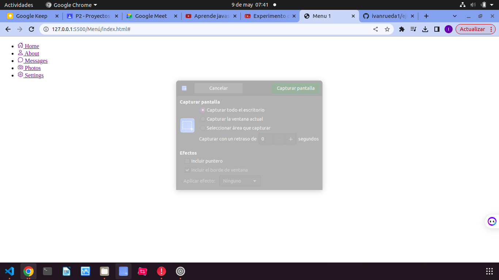
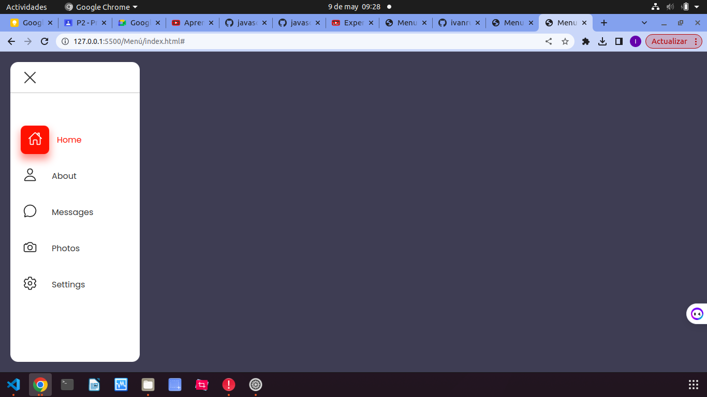
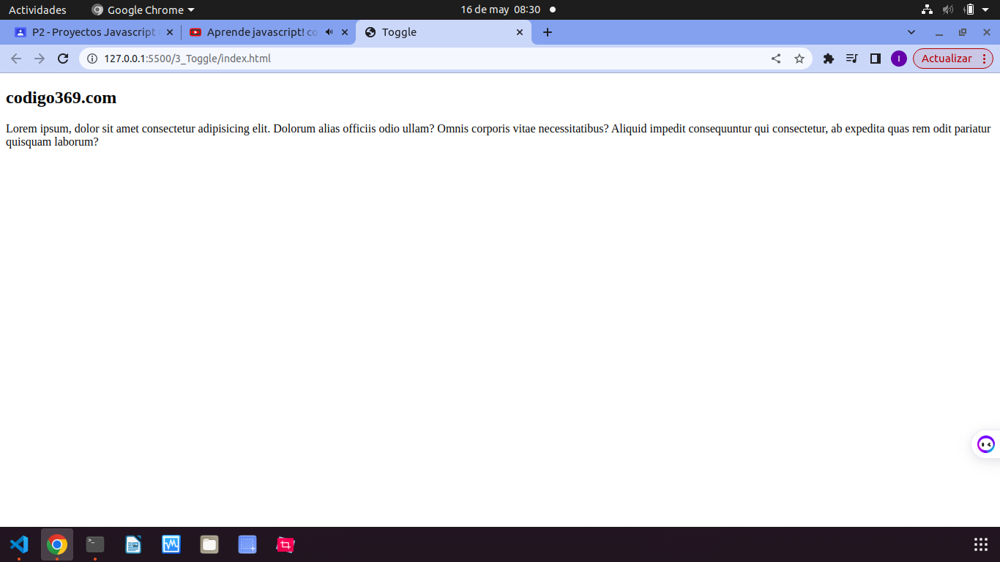

# Ejercicio 1

# Codigo index

# Codigo Script.js

## este codigo implementa toda la funcionalidad de la calculadora

# Codigo css

## Al aplicar el css ya la calculadora se ve mucho mejor

 

# Ejercicio 2 "Menu"
 
 # Codigo Index

 ## Lo primordial que hicimos en el index fue que con la pagina llamada "ionicons" insertamos 5 iconos para difentes botones.

 

 # Style.scss

## Primero que todo copiamos un codigo la cual nos coloca el tipo de letra llamado poppins que nos proporciona googleapis, luego quitamos margenes y padding, luego agregar la letra que aplicamos ahorita llamda poppins, luego con body el agregamos color a la letra, luego con el div llamado navegacion despues agregamos con "position" que sea fija, luego insent para pasar objetos a diferentes posiciones de la pantalla, luego acomodamos ancho y acomodamos el resto del programa como el  color de fondo, contenido de izquierda a derecha y terminamos con los bordes luego ya empezamos a acomodorar las posiciones del menu, luego con la variable after acomodamos las 3 rayas para el despliegue de la barra lateral o menú, luego le areglamos el tamaño al bloque en donde se encuentra el menu con la variable (li) que la bautisamos en el index, luego con la variable (active) acomodamos el tamaño de los iconos para cuando se despliegue el menu.

## Con script.js, Empezamos dandole una constante a la variable llamada "menutoggle" esta variable son las tres rayas que aparecen la parte superior del menu, luego agregamos el onclick para que al darle click se espanda, tambien activamos los links.

# Ejercicio 3

## Empezamos este ejercicio implementando un titulo y un texto en el index

