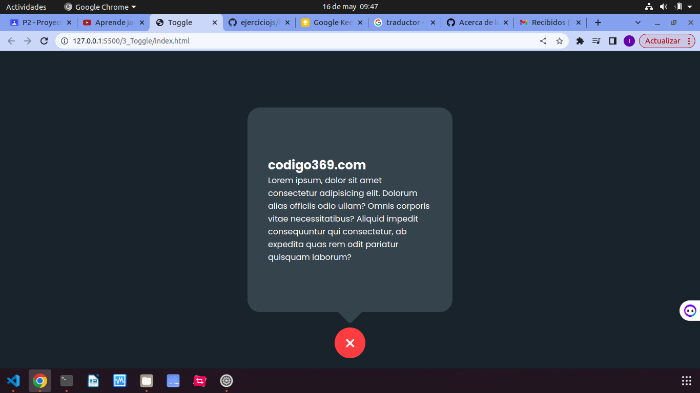
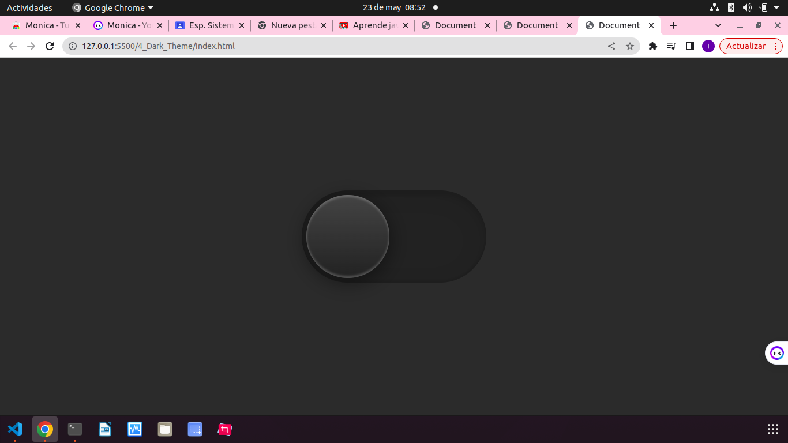
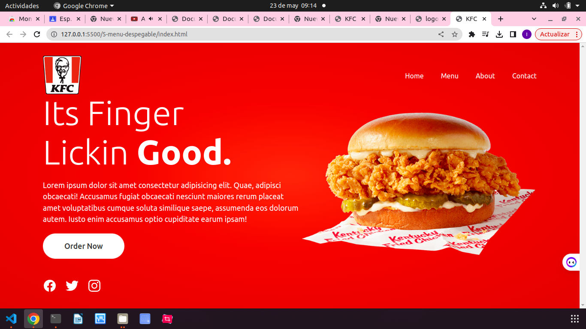

# Ejercicio 1

# Codigo index

# Codigo Script.js

## este codigo implementa toda la funcionalidad de la calculadora

# Codigo css

## Al aplicar el css ya la calculadora se ve mucho mejor

 

# Ejercicio 2 "Menu"
 
 # Codigo Index

 ## Lo primordial que hicimos en el index fue que con la pagina llamada "ionicons" insertamos 5 iconos para difentes botones.

 

 # Style.scss

## Primero que todo copiamos un codigo la cual nos coloca el tipo de letra llamado poppins que nos proporciona googleapis, luego quitamos margenes y padding, luego agregar la letra que aplicamos ahorita llamda poppins, luego con body el agregamos color a la letra, luego con el div llamado navegacion despues agregamos con "position" que sea fija, luego insent para pasar objetos a diferentes posiciones de la pantalla, luego acomodamos ancho y acomodamos el resto del programa como el  color de fondo, contenido de izquierda a derecha y terminamos con los bordes luego ya empezamos a acomodorar las posiciones del menu, luego con la variable after acomodamos las 3 rayas para el despliegue de la barra lateral o menú, luego le areglamos el tamaño al bloque en donde se encuentra el menu con la variable (li) que la bautisamos en el index, luego con la variable (active) acomodamos el tamaño de los iconos para cuando se despliegue el menu.

## Con script.js, Empezamos dandole una constante a la variable llamada "menutoggle" esta variable son las tres rayas que aparecen la parte superior del menu, luego agregamos el onclick para que al darle click se espanda, tambien activamos los links.

# Ejercicio 3

## Empezamos este ejercicio implementando un titulo y un texto en el index

# Script

## Primero en la carpeta script definimos las variables con el index , luego con onclick definimos que se va a ejecutar cada vez que nosotros demos click, luego con la variable (class.list) le decimos que nos enliste todas las clases que tenga en ese container y ubicarlas en el toggle, luego con la variable (active) podemos registrar en css, para no tener que hacerlo en el index

# Vamos con el css

## Empezamos incorporando el tipo, luego en el container acomodamos el alto y el ancho, pero lo dejamos en 0,luego vamos manipulando el codigo para que se expanda al darle click, insertamos los colores, todo los relacionado con el diseño, padding, los pixeles(width,height,display,background-color,transition entre otros.) y ya hecho el css quedaria de esta manera.

# Ejercicio 4

## En este ejerciciono utilizaremos demasiado html, iremos a realizar todo con css y script.

## En el index refenciamos ccs y script y tambien haremos un div y en un "class" in decorador que llamaremos "indicator"

## En css empezamos con style.scss con un "body" en la que hay empezamos con un color de fondo, tambien con "flex" que sean flexibles, tambien que el flex-direction se conforme como una sola columna, tambien una "transition" para que no haya un cambio brusco. Luego le damos estilos al "toogle" esto es lo que va hacer por asi decirlo el boton al toggle le agregmos la posicion, que se relativa y que tenga un displei tipo block que lesea como un bloque y poder tener estilos de border radios, tambien le damos un ancho y un alto definido, tambien un backgraund para empezar a darle color al toggle, tambien le hacemos unos difuminados para que se vea mejor, tambien le vamos a decir que cada vez que pasemos el mouse por ahi cambia tipo pointer con "CURSOR= POINTER" tambien apliquemos una escala para que el botoncito se vea mas pequeño, tambien con "box shadow" le agregamos sombras.

## En el archivo "script.js" capturamos nuestra clase "body", tambien capturamos el "toggle" luego configuramos el toggle es como nuestra palanca para cambiar del tema oscuro al claro con toggle.classlist para agregar todas las clases, hacemos lo mismo con body lo activamos luego con un "box-shadow" agregamos que al dar click cambie su color.

# Ejercicio 5

## Se establece un fondo degradado radial en el contenedor principal con colores rojos (#f0483a). El contenido se centra vertical y horizontal,Se define una cabecera con un logotipo y una barra de navegación que se posiciona en la parte superior. La barra de navegación contiene enlaces representados por listas no ordenadas.Hay un contenido principal que consta de un título, un párrafo (p) y un botón (btn). El contenido se muestra en forma de columna y se distribuye de manera uniforme en el espacio disponible.

## Se implementa un slider o carrusel de imágenes que muestra varias diapositivas. Cada diapositiva se representa con un elemento de imagen (img). Las diapositivas se ocultan o muestran según su estado activo.Se define un pie de página (footer) que se posiciona en la parte inferior de la página y contiene enlaces de redes sociales representados por listas no ordenadas.Se utilizan consultas de medios (@media) para aplicar estilos específicos en diferentes tamaños de pantalla. Los cambios incluyen ajustes en los márgenes, el tamaño del logotipo, el diseño del contenido, la visibilidad de la barra de navegación y la aparición de un menú desplegable en pantallas más pequeñas.

## En resumen, el código CSS proporcionado establece la apariencia visual y la disposición de los elementos en una página web, utilizando colores degradados, una estructura de cabecera y pie de página, y estilos responsivos para adaptarse a diferentes tamaños de pantalla.

# styles.scss

## El selector hace que se aplique los siguientes estilos a todos los elementos: margen y padding se establecen en 0, el box-sizing se establece en border-box y la fuente se establece en "Ubuntu" con una fuente alternativa sans-serif.

## La clase .main estiliza el elemento contenedor principal. Establece el fondo como un degradado radial, centra su contenido vertical y horizontal.
## header estiliza el elemento de encabezado. Lo posiciona en la parte superior de la págin
## La clase .logo estiliza un elemento de logotipo, estableciendo el ancho máximo.
## La clase .navigation estiliza un elemento de navegación y sus elementos de lista y enlaces.
## header estiliza el elemento de encabezado. Lo posiciona en la parte superior de la página
## La clase .content estiliza una sección de contenido con texto y un botón.
## La clase .text estiliza el texto dentro de la sección de contenido, incluyendo encabezados y párrafos.
## La clase .btn estiliza un elemento de botón.
## La clase .slider estiliza una sección de deslizador, incluyendo diapositivas e imágenes.
## La clase .footer estiliza una sección de pie de página en la parte inferior de la página.

